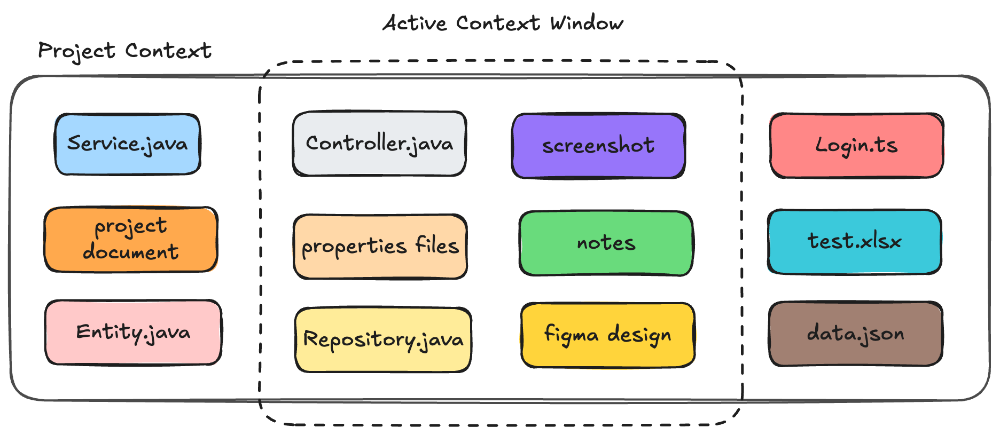
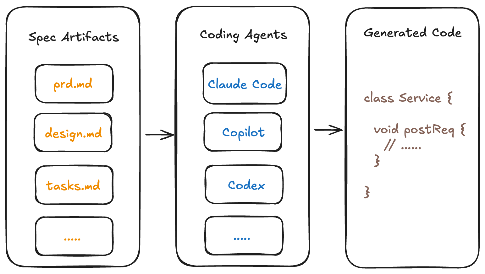
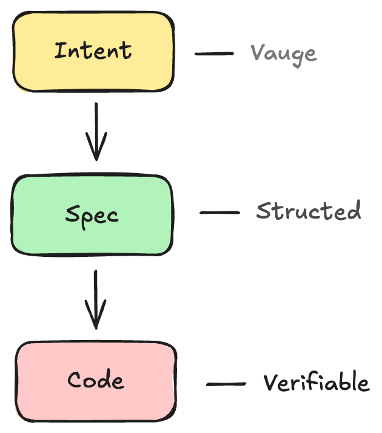

<!--markpress-opt
{
  "autoSplit": false,
  "sanitize": false,
  "title": "Your AI Doesn't Know What You Want"
}
markpress-opt-->

<!--slide-attr x=0 y=0 scale=1.2 -->

# Your AI Doesn't Know What You Want
## (And Neither Do You)

Spec-Driven Development with OpenSpec

<!-- SPEAKER NOTES — Slide 1 (~1 min)
- Put the title up. Say nothing. Let it land.
-->

------

<!--slide-attr x=1700 y=-300 rotate=-2 scale=1.0 -->

# Reality Check

- Who has shipped AI-generated code that changed the **wrong thing**?
- Who noticed the output getting **worse** the longer the session ran?
- Who didn't know how to **break the session** and continue cleanly?

<!-- SPEAKER NOTES — Slide 2 (~2 min)
- Ask each question as a show-of-hands moment. Pause between them.
- The goal is recognition — they're not alone. This is everyone's daily reality.
-->

------

<!--slide-attr x=2400 y=1600 rotate=-5 scale=1.0 -->

# My Painful Story

- Microservice project: changes scattered across **multiple repos + a legacy monolith**
- AI jumped straight to generating — no full-picture exploration
- **Long exhausting chat session** with constantly steering back and forth.
- Wrong code. Wrong changes. **Line-by-line review of nonsense.**
- **Performance** dropped. **Frustration** rose.
- I started **dreading** the tool I was supposed to love.

<!-- SPEAKER NOTES — Slide 4 (~2 min)
- This was a real professional project. The codebase was spread across services and a legacy system that the AI had only partial visibility into.
- It didn't know enough — it just started generating confidently.
- I only found the problems at review time, which was already too late. The AI had just enough context to be dangerous, but not enough to be correct.
- The review burden flipped from lightweight check to full audit. That's not sustainable.
-->

------

<!--slide-attr x=3200 y=400 rotate=3 scale=1.0 -->

# Where Does It All Go Wrong?

- We are already **vibe coding for serious work** — we just don't call it that
- Our prompts are business-language: they say **what** the user want, not **how** it should be built
- AI explores the codebase — but **guesses** the technical detail we left out
- Vague intent → hallucinations → wrong class, wrong file, wrong assumption

<!-- SPEAKER NOTES — Slide 3 (~2 min)
- Vibe coding isn't just a prototype habit. Any time you prompt without explicit technical intent, you're vibe coding.
- The prompt describes requirements in plain language — suitable for a ticket, not for a compiler.
- The AI doesn't refuse to act on vague input. It fills in the gaps by guessing. It explores the codebase, but it takes shortcuts and picks the path that looks most plausible.
- That's where hallucinations come from — not randomness, but confident guessing on incomplete information.
- And sessions compound the problem: the longer it runs, the more context drifts, and the worse the output gets.
-->

------

<!--slide-attr x=3200 y=400 rotate=3 scale=1.0 -->

# Context Windows Limitation

------

<!--slide-attr x=800 y=2300 rotate=2 scale=1.1 -->

# What Is Spec-Driven Development (SDD)?

Create the **specification artifact** first — everything else is derived from it

**The spec is the shared understanding between you and the AI**

> BDD, TDD, OpenAPI contract-first, ... share the same concept

<!-- SPEAKER NOTES — Slide 5a (~3 min)
- SDD isn't revolutionary — it's disciplined. The ideas behind it have existed in BDD, TDD, and API-first design for years.
- What's new is using the spec as the context layer you give to AI agents. The AI no longer guesses — it works inside boundaries you reviewed first.
- Each artifact feeds the next. You review each one before the AI proceeds.
-->

------

<!--slide-attr x=-900 y=2200 rotate=-2 scale=1.0 -->

# The SDD Workflow

| Stage | What Happens |
|-------|-------------|
| **Spec** | Define **.md** artifacts such as *prd.md*, *research.md*, *design.md*, *tasks.md*, ... |
| **Implement** | AI read Spec artifacts and implement within the Spec context |
| **Validation** | Verify implementation against the spec |
| **Archive** | Archive after implementation done |

<!-- SPEAKER NOTES — Slide 5b
- Walk through each stage: Plan scopes the problem. Spec details requirements. Tasks break it into execution steps. Then the AI implements. Validation checks against the spec. Archive keeps context alive.
- The key insight: every stage is a review gate. The AI only moves forward once you've approved the previous artifact.
-->

------

<!--slide-attr x=-2200 y=1200 rotate=4 scale=1.0 -->

# Vibe Coding vs Spec-Driven

| Vibe Coding | Spec-Driven |
|-------------|-------------|
| Prompt → hope | Spec → high quality generated code |
| AI guesses scope | AI works inside defined scope |
| Session decays | Resume anywhere from the spec |
| Review code | Review intent |
| One long chaotic session | Small, scoped, well-defined changes |

<!-- SPEAKER NOTES — Slide 6 (~2 min)
- The biggest shift is *when* you review. In vibe coding, you review code after it's written — when it's already expensive to change.
- With SDD, you review intent before the AI writes a single line. Cheap to steer at that stage.
- The session decay problem is solved by the spec itself — you can close a session, open a new one, hand it the spec, and continue exactly where you left off.
-->

------

<!--slide-attr x=-2500 y=100 rotate=-3 scale=1.05 -->

# The Intent Compiler

> A compiler catches errors before your code runs.
> Spec catches misunderstandings before your AI codes.

- Spec stage → **cheap to steer**
- Implementation stage → expensive to steer
- Production → impossible to steer

<!-- SPEAKER NOTES — Slide 7 (~2 min)
- Every developer knows you don't skip compilation. It catches errors early, when they're cheap.
- SDD is the same idea applied to intent. You compile your requirements before the AI touches the keyboard.
- The error cost curve is well-established in software engineering — bugs caught at spec stage cost a fraction of bugs caught at production. SDD moves the review gate to the earliest possible moment.
- This is the frame I want you to carry for the rest of the talk.
-->

------

<!--slide-attr x=-2000 y=-400 rotate=1 scale=1.0 -->

# Review the Spec

> Always review the spec to ensure a shared understanding between you and your AI

- **Catch Gaps early**: Did we miss an edge case?
- **Verify Design**: Is this the right pattern?
- **Check Scope**: Too much or too little?
- **Check Hallucination**: Where does this come from?

<!-- SPEAKER NOTES — Slide 7.5 (~2 min)
- This is the "Review Gate". It's the most critical part of the process.
- You are reviewing the *plan* for code, not the code itself.
- Don't let the AI proceed until you'd be willing to bet on the spec's correctness.
-->

------

<!--slide-attr x=-1400 y=-850 rotate=2 scale=1.0 -->

# SDD with OpenSpec

- OpenSpec is a meta prompt tool to instruct AI explore project context and generate Scoped Spec artifacts
- OpenSpec artifacts are well scoped, reviewable, and has browfield project as first-class support

| | spec-kit | GSD | OpenSpec |
|-|----------|-----|----------|
| Artifact volume | High | Very high | **Low** |
| Human review checkpoints | Medium | Low | **High** |
| Noise level | High | Very high | **Low** |

<!-- SPEAKER NOTES — Slide 8 (~2 min)
- I tried spec-kit and GSD (Get Shit Done) before landing on OpenSpec. Both are capable tools, but they generate a lot of files — GSD alone creates PROJECT.md, REQUIREMENTS.md, ROADMAP.md, STATE.md plus a full research folder per milestone.
- When review is tedious, developers skip it. A spec nobody reads is just documentation debt.
- OpenSpec works differently: each change is a delta — scoped to exactly what's changing, nothing more.
- The explore step is what made it click for brownfield work. Before writing any spec, it understands your existing codebase. The spec it generates is grounded in your actual code, not imagination.
-->

------

<!--slide-attr x=0 y=-200 scale=1.3 -->

# Closing

**Your AI knows what you want (and also you) if there is enough context**

- The answer isn't a better prompt. It's a clearer understanding and better spec artifacts.
- SDD is ahead-of-time compilation for your intent.
- Apply SDD for implementing a feature then evaluate.

<!-- SPEAKER NOTES — Slide 9 (~4 min)
- Return to the title. The joke lands differently now — it's not just a punchline, it's a diagnosis.
- The audience has been prompting their AI with business language and hoping the technical gaps fill themselves. They do — just not correctly.
- SDD doesn't slow you down. It moves the thinking earlier, when it's cheap, and frees the AI to execute reliably rather than guess.
- Close with the compiler analogy one more time: "You wouldn't ship without compiling. Don't build without speccing."
- Leave them with one action: pick the next feature on your backlog. Write a spec for it before you touch the AI. Just try it once.
-->
